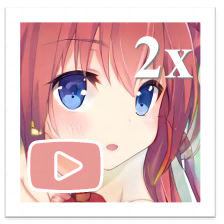

# Anime2x-qt 

这个工具允许你使用高质量对你的动漫视频进行插帧和提升分辨率。/This tool allows you to interpolate and upscale your anime video or GIF with high quality.


## 配置要求/Requirements

* 操作系统/Operating System: Windows X64
* 显卡/Graphics Card: 支持Vulkan/Vulkan Support

## 注意事項/Notice

(1)请不要使用系统路径作为输出路径。/Please don't use the system path as the output path.

(2)请务必检查您的显卡是否支持 Vulkan。 从以下 URL 检查是否支持 GPU。/Be sure to check your graphics card with Vulkan support. Check if GPU is supported from the following URL.

* Intel GPU: https://www.intel.com/content/www/us/en/support/articles/000005524/graphics.html
* AMD GPU: https://www.amd.com/en/technologies/vulkan
* NVIDIA GPU: https://developer.nvidia.com/vulkan-driver

或者您可以使用这个工具检查是否支持Vulkan。/Or you can use this tool to check if Vulkan is supported.

https://github.com/skeeto/vulkan-test/releases/download/1.0.2/vulkan_test.exe

(3)如果您遇到崩溃或错误，请尝试升级您的 GPU 驱动程序。/If you encounter crash or error, try to upgrade your GPU driver.

* Intel: https://downloadcenter.intel.com/product/80939/Graphics-Drivers
* AMD: https://www.amd.com/en/support
* NVIDIA: https://www.nvidia.com/Download/index.aspx


## 运行/Manual

解压后打开 Anime2x.exe 并按照说明进行操作。

(1) 在文件面板中设置你的输入路径和输出路径。

(2) 在配置面板中选择你偏好的参数。（更大的比例需要更长的处理时间和更大的磁盘空间。）

(3) 点击操作面板中的生成按钮，然后等待几分钟来处理。

Open Anime2x.exe after unzipping and follow the instructions.

(1) Set your input path and output path in Files Panel. 

(2) Select your preferred parameters in Configs Panel. (Larger ratio NEEDS longer time and larger disk space.)

(3) Click generate in Action Panel and wait for several minutes to process.

## Develop

1. Clone the repository

2. Download rife and real-esrgan package
```
wget https://www.gyan.dev/ffmpeg/builds/ffmpeg-git-full.7z
7z x ffmpeg-git-full.7z -offmpeg
wget https://github.com/nihui/rife-ncnn-vulkan/releases/download/20221029/rife-ncnn-vulkan-20221029-windows.zip
unzip rife-ncnn-vulkan-20221029-windows.zip -d rife
wget https://github.com/xinntao/Real-ESRGAN/releases/download/v0.2.3.0/realesrgan-ncnn-vulkan-20211212-windows.zip
unzip realesrgan-ncnn-vulkan-20211212-windows.zip -d realesrgan
```

3. Prepare python environment
```
pip install PySide6
```

4. Run the program
```
python main.py
```

## Build

1. Prepare python environment
```
pip install PyInstaller
```

2. Build package
```
pyinstaller --onefile --windowed --icon=icon.ico main.py  --add-data "realesrgan;realesrgan" --add-data "rife;rife" --add-data "ffmpeg;ffmpeg" --add-data "icon.ico;." 
```

## Privacy

* We access your selected images to process. 
* We do not collect any of your informations.

## Credit

* The RIFE engine is from [rife-ncnn-vulkan](https://github.com/nihui/rife-ncnn-vulkan).
* The Real-ESRGAN engine is from [Real-ESRGAN-ncnn-vulkan](https://github.com/xinntao/Real-ESRGAN-ncnn-vulkan).
* The GUI is built with [Pyside6](https://doc.qt.io/qtforpython/).
